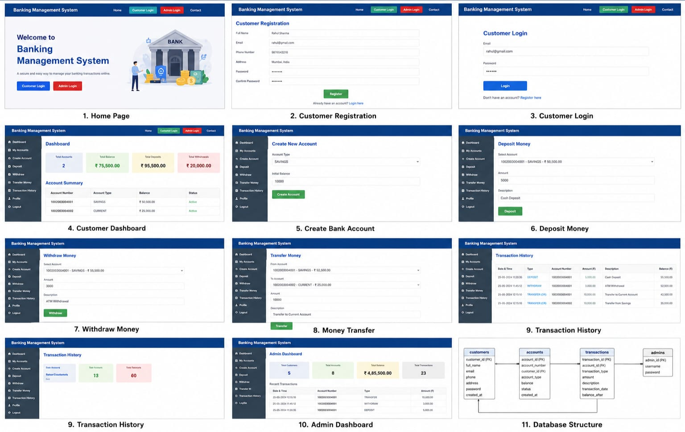

# 🏦 Banking Management System

A web-based **Banking Management System** developed using **Java, JSP,
Servlets, JDBC, MySQL, Maven, HTML, and CSS**.

The application provides basic banking operations such as customer
registration, login, account creation, deposits, withdrawals, money
transfers, transaction history, and administration.

## 📌 Project Overview

The Banking Management System is designed to simplify common banking
operations through a web application.

Customers can create and manage bank accounts, perform transactions, and
view transaction history. Administrators can monitor customers,
accounts, and transactions.

## 🚀 Features

### 👤 Customer Module

-   Customer registration
-   Customer login
-   Customer profile
-   Session-based authentication
-   Account creation
-   View account balance
-   Deposit money
-   Withdraw money
-   Transfer money
-   View transaction history

### 🛡️ Admin Module

-   Admin login
-   View customers
-   View bank accounts
-   Monitor transactions
-   Manage banking information

### 💳 Banking Operations

-   Savings account creation
-   Balance management
-   Deposit transactions
-   Withdrawal transactions
-   Account-to-account transfers
-   Transaction records

## 🛠️ Technologies Used

  Technology      Purpose
  --------------- -----------------------------------
  Java            Main programming language
  JSP             Dynamic web pages
  Servlets        Request handling and controllers
  JDBC            Java-MySQL database connectivity
  MySQL           Database management
  HTML            Web page structure
  CSS             User interface styling
  Maven           Dependency and project management
  Apache Tomcat   Web application server
  Eclipse         Development environment

## 🏗️ Project Architecture

``` text
JSP / HTML / CSS
       ↓
   Servlets
       ↓
    Service
       ↓
   DAO + JDBC
       ↓
     MySQL
```

## 📂 Project Structure

``` text
BankingManagementSystem/
│
├── src/
│   └── main/
│       ├── java/
│       │   └── com/
│       │       └── banking/
│       │           ├── controller/
│       │           ├── dao/
│       │           ├── model/
│       │           ├── service/
│       │           └── util/
│       │
│       ├── resources/
│       │   └── database.properties
│       │
│       └── webapp/
│           ├── admin/
│           ├── account/
│           ├── customer/
│           ├── transaction/
│           ├── css/
│           └── index.jsp
│
├── database/
│   └── banking_database.sql
│
├── pom.xml
├── README.md
└── .gitignore
```

## 🗄️ Database

The application uses **MySQL**.

### Database

``` text
banking_db
```

### Main Tables

``` text
customers
accounts
transactions
admins
```

### Relationship

``` text
Customer
   │
   └───< Accounts
             │
             └───< Transactions
```

A customer can have one or more bank accounts, and each account can have
multiple transactions.

## ⚙️ Prerequisites

Install the following before running the project:

-   JDK 17 or compatible Java version
-   Eclipse IDE
-   Apache Tomcat
-   MySQL Server
-   MySQL Workbench
-   Maven

Check Java:

``` bash
java -version
```

Check Maven:

``` bash
mvn -version
```

## ▶️ How to Run

### 1. Clone the Repository

``` bash
git clone https://github.com/YOUR-USERNAME/BankingManagementSystem.git
cd BankingManagementSystem
```

### 2. Import into Eclipse

Open Eclipse:

``` text
File → Import → Maven → Existing Maven Projects
```

Select the `BankingManagementSystem` folder and click **Finish**.

### 3. Configure MySQL

Open MySQL Workbench and execute:

``` text
database/banking_database.sql
```

This creates the required database and tables.

### 4. Configure Database Credentials

Open:

``` text
src/main/resources/database.properties
```

Update the credentials for your local MySQL installation:

``` properties
db.url=jdbc:mysql://localhost:3306/banking_db?useSSL=false&serverTimezone=UTC
db.username=root
db.password=YOUR_MYSQL_PASSWORD
```

**Do not commit your real MySQL password to a public GitHub
repository.**

### 5. Configure Apache Tomcat

Add Apache Tomcat to Eclipse through:

``` text
Window → Preferences → Server → Runtime Environments → Add
```

Select the appropriate Apache Tomcat installation.

### 6. Run the Application

Right-click the project:

``` text
Run As → Run on Server
```

Then open the application in your browser:

``` text
http://localhost:8080/BankingManagementSystem/
```

## 🔄 Application Flow

``` text
Customer Registration
        ↓
Customer Login
        ↓
Customer Dashboard
        ↓
Create Bank Account
        ↓
Deposit / Withdraw
        ↓
Money Transfer
        ↓
Transaction History
```

## 🔐 Demo Admin Credentials

For demonstration purposes:

``` text
Username: admin
Password: admin123
```

Change these credentials before using the application in a real
environment.

## 🔒 Security Considerations

This project demonstrates basic authentication and database operations.
For a production banking application, additional security should be
implemented:

-   Password hashing
-   HTTPS
-   OTP/MFA authentication
-   Input validation
-   SQL injection prevention
-   CSRF protection
-   Secure session management
-   Environment variables for credentials
-   Proper authorization and access control

## 🔮 Future Enhancements

-   OTP-based authentication
-   Email transaction notifications
-   Responsive mobile interface
-   PDF bank statements
-   Real-time transaction notifications
-   Debit/credit card management
-   Advanced admin analytics
-   Two-factor authentication
-   Downloadable transaction statements
-   Cloud deployment

## 📸 Output



## 🎥 Project Demo

A demo walkthrough can be added to the repository as:

``` text
BankingManagementSystem_Demo.mp4
```

## 👩‍💻 Developer

**R Varshitha**

B.Tech -- Computer Science Engineering

## 📄 License

This project is developed for **educational and academic purposes**.
